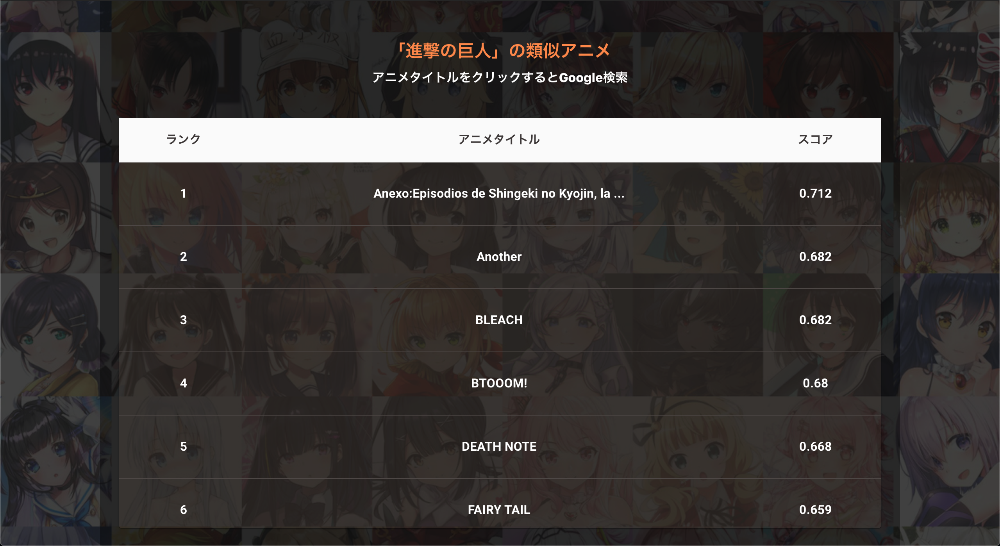

# FastAPI-AnimeRecommender

[このレポジトリ ](https://github.com/imoken1122/turicreate-AnimeRecommender) で作ったアニメレコメンダー
をWeb上でデモとして遊べるように React と FastAPI を用いて作成. 

React によるフロントエンドの実装は[こちら](https://github.com/imoken1122/)

Heroku にデプロイしたデモが[こちら](https://arncmd.herokuapp.com/React-AnimeRecommender)

 

### 環境

- Python 3.7
- fastapi==0.65.1
- turicreate==6.4
- pydantic==1.8.2
- python-Levenshtein==0.12.2
- pykakasi==2.1.1
- googletrans==4.0.0rc1

 

### プレビュー

 

背景のイラストは, Kaggleに置いてある[another-anime-face-dataset](https://www.kaggle.com/scribbless/another-anime-face-dataset) から拝借しました

